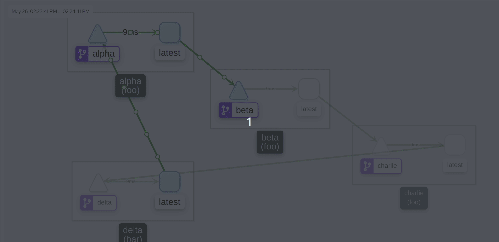
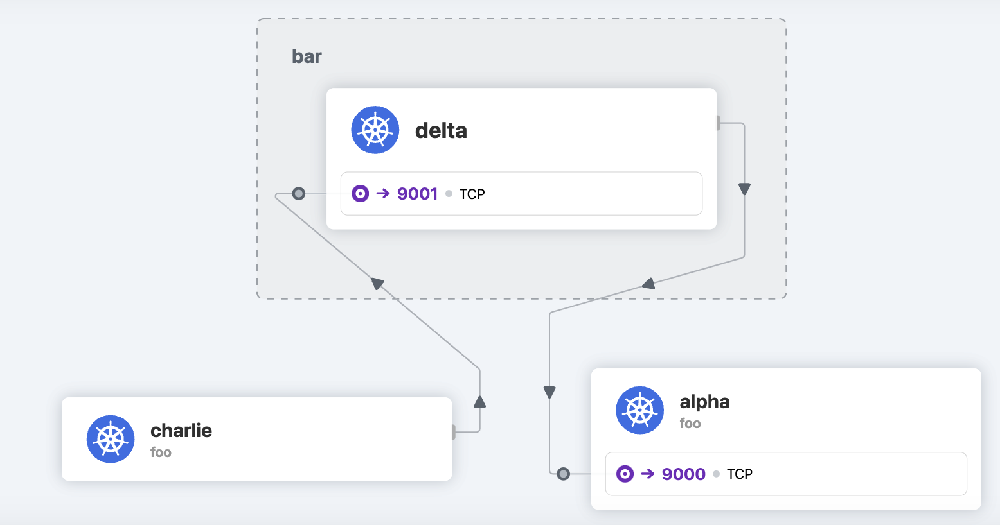
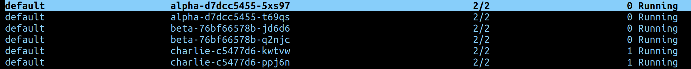

# Simple Service Tester ( SST )

Use this to test if Kubernetes cluster service to service communication is working. This deploys some very dumb grpc services that talk to each other. It is useful for testing if your cluster is working correctly.

- All code included
- Uses HTTP/2
- Creates four basic GRPC services that talk to each other.

It has proven useful for sanity checks...

### Installation

`make install`

#### Customisation

Look at the `values.yaml` file to customise the deployments and change the point to point relationships.